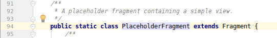

Activities and Fragments
========================

We've just got our first app running on our tablet. It doesn't really do much, it just has a couple of tags that show the same(ish) text and have the same(ish) titles.

Below, we have a general overview of the parts you'll see in your app. The bar across the top is call the AppBar and contains the Toolbar (with a Menu Button) and the TabLayout. The bottom half contains a ViewPager and a Floating Action Button. Note that the Button is not part of the ViewPager, it just sits on top of it.

[](images/app_parts.png)
*The different parts of our app's screen*

The body of the tabs is something Android calls a Fragment. The tabs that have been created for us are "placeholder" Fragments which aren't very useful. Our next task is to build our own Fragment and use it instead of the placeholder Fragment.

# Creating a New Fragment

1) First, find our package folder. If you named the package using the school's domain, it will be the folder that looks like 

    au.edu.catholic.goodshepherd.myapplication

[](images/click_package.png)  
*Your package folder should look like this*

2) Then right-click and in the menu, select *New > Fragment > Fragment (Blank)*

3) Give your Fragment a name. I'm going to use this as the first tab so I'll call mine "`HomeFragment`" (If you use something different, be sure to keep track of what it was). Unselect the two "Include" checkboxes too. 

[](images/fragment_configure_component.png)  
*Unselect these two checkboxes*

4) Click **Finish**

You've just created a new Fragment! If you run the app on the tablet now, nothing will have changed. We need to get MainActivity to use our new Fragment.

# Using the New Fragment

The code that's responsible for loading Fragments is in our activity `MainActivity`, so we're going to find where the PlaceholderFragment is loaded and change it to our Fragment.

1) Open `MainActivity`  
[](images/project_view_main_activity.png)  

2) Find where the PlaceholderFragment is loaded. It should be close to the bottom of the file.  
[](images/load_placeholder_fragment.png)  


3) Replace the `PlaceholderFragment` with `HomeFragment` like this:

Remove:

```java
// getItem is called to instantiate the fragment for the given page.
// Return a PlaceholderFragment (defined as a static inner class below).
return PlaceholderFragment.newInstance(position + 1);
```

Add:

```java
return new HomeFragment();
```

You can run your app now and see your new Fragment in play. There's one problem though: There are 3 copies being created and we don't want that, plus, they're all named "Section N".

# Removing the Duplicate tabs

The way that our tabs are created at the moment is to just create 3 copies of the Fragment, no matter what. We want to change this so we can specify which Fragment we want to load and give them individual tab names.

In `MainActivity`, we have `SectionsPagerAdapter` which is in charge of creating our tabs. So, find `SectionsPagerAdapter`, because the changes we make are going inside it.

1) Create 2 arrays: one for our `Fragment`s and one for our tab names. Lets put our `HomeFragment` in there too:

```java
Fragment[] fragments = { new HomeFragment() };
String[] tabNames = { "Home Tab" };
```

2) Change `getItem`/`getCount`/`getPageTitle` to return from our arrays:

---
### getItem:
```java
public Fragment getItem(int position) {
    return new HomeFragment();
}
```
becomes
```java
public Fragment getItem(int position) {
    // return the fragment defined in our array at the given position
    return fragments[position];
}
```

---
### getCount:

```java
public int getCount() {
    // Show 3 total pages.
    return 3;
}
```
becomes
```java
public int getCount() {
    // return the length of our array of Fragments 
    return fragments.length;
}
```

---
### getPageTitle
```java
public CharSequence getPageTitle(int position) {
    switch (position) {
        case 0:
            return "SECTION 1";
        case 1:
            return "SECTION 2";
        case 2:
            return "SECTION 3";
    }
    return null;
}
```
becomes
```java
public CharSequence getPageTitle(int position) {
    // return the name defined in our array at the given position
    return tabNames[position];
}
```

---

We've put the Fragments and tab names into an array, so now we can add more later and they will appear next to our Fragments.

Go ahead and run the app now, you should see just the one tab now, with the name **HOME TAB**.

Now we should clean up the `PlaceholderFragment` we are no longer using.

# Removing the Placeholder Fragment

### Delete the definition PlaceholderFragment

The placeholder Fragment is found in the file `MainActivity`. We are going to delete the code where it's defined, fix the old code that pointed to it, and delete the resources it used.

1) Open `MainActivity`  
[](images/project_view_main_activity.png)  

2) Find `PlaceholderFragment`. It should be able halfway down, on `line 94`  
[](images/placeholder_fragment.png)  
It's a good idea to take notice of which layout file `PlaceholderFragment` uses, you can see this on `line 119`. We are going to delete this file too, later.  
[](images/fragment_main_name.png)  
*Circled in red, the (R)esource layout name: **fragment_main***.


3) Right-click `PlaceholderFragment` > Refactor > Safe Delete (Alt+Delete).  

4) Click **OK** (Safe Delete Search alert box)

5) Click **Delete Anyway** if prompted to do so.

Now our `PlaceholderFragment` is gone but we should delete the unused layout file.

### Delete the file `fragment_main.xml`

These `.xml` files contain the layout information that is used to create the views. Since we've delete `PlaceholderFragment`, we won't be needing its layout. Previously, we saw that `PlaceholderFragment` was using a layout resource called `fragment_main` so let's delete that. 

1) Find the file res/layout/fragment_main.xml
2) Right-click > Delete (or just press Delete)
3) Press **OK**

Run your app again. Running your app is a really good way to test if your code change has worked. Android Studio will usually tell you if something's wrong anyway.

# Task 1 Complete!

We successfully created a new app then created a new Fragment and modified our Activity to show it correctly. It's stil not very exciting but we'll be adding new things to change that and using what you've learned, you can come back and make your Home Tab look good.

## Next: [Task 2 - Accelerometer](task2_accelerometer.md)