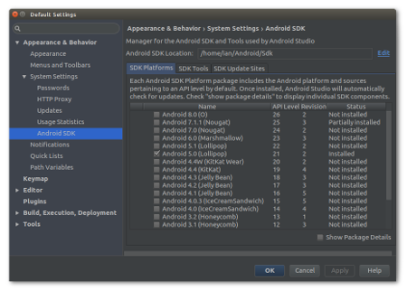

Getting Started
===============

Open Android Studio

# Checking Our SDK

SDK Stands for Software Development Kit and is typically a collection of tools and code that allow us to create programs for a given platform. Since we are creating apps for Android, we will need to make sure our Android SDK is configured for the devices we are targetting.

Device: Lenovo Tab3 7" Essential.  
Device Software: Android Lollipop 5.0.1 (API Level 21)  
*See: **Settings > About Tablet** for more information.*

If we have a project open, we can check the SDK levels from the menu by selecting:

**Tools > Android > Android SDK**

Or from the Welcome Screen:

**Configure > Android SDK**

### What to Select

Since you have had a couple of classes in Android already, these should already be selected, but it's good to double check.

In the **SDK Platforms** tab (check the box **Show Package Details** in the bottom right corner)

- Android 7.1.1 (Nougat)
    - [&check;] Android SDK Platform 25
- Android 5.0 (Lollipop)
    - [&check;] Google APIs
    - [&check;] Android SDK Platform 21
    - [&check;] Sources for Android 21

In the **SDK Tools** tab (check the box **Show Package Details** in the bottom right corner)

- Android SDK Build-Tools
    - [&check;] 26.0.2
- [&check;] Android SDK Platform-Tools
- [&check;] Android SDK Tools
- [&check;] Google Play APK Expansion Library
- [&check;] Google Play services
- Support Repository
    - ConstraintLayout for Android
        - [&check;] 1.0.2
    - Solver for ConstraintLayout
        - [&check;] 1.0.2
    - [&check;] Android Support Repository
    - [&check;] Google Repository

For more information on the SDK Manager, check out the Android Developer Docs:  
https://developer.android.com/studio/intro/update.html#sdk-manager

## Next: [Creating a Project](//todo)