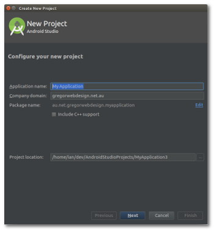

Creating a Project
==================

We will want to create a new project to target the device we are building on. Let's start the Project wizard from the menu:

**File > New Project**

### New Project

Choose your **Application's Name** and Company domain. Since I am the business GregorWebDesign, I will be using my domain name `gregorwebdesign.net.au` but you can use the school's domain: `goodshepherd.catholic.edu.au`, the example domain: `example.com`, or you can put it whatever you like. 

You won't need to worry about the **Project location**; The default directory should be fine.

**> Next**

### Target Android Devices

We are building specifically for **API 21: Android 5.0 (Lollipop)** so select that from the list. You can choose lower if you want to be able to upload your app to older devices but we don't need to for this workshop so let's keep it simple.

**> Next**

### Add an Activity to Mobile

Here, we have to choose an Activity to start with. The main purpose of this application is to be a showcase of the different features of the device, so let's go with a Tabbed Activity.

*I just want to mention that we can easily add and remove Activities later, so choosing correctly here isn't too important. It's just a very convenient starting point.*

**> Next**

### Customise the Activity

  
*Select **Action Bar Tabs (with ViewPager)** from the dropdown menu.*

We can customise our chosen activity here by choosing names for the different parts. At the moment, these can just stay as-is because Main Activity is fairly descriptive as it will be the main screen we will be using.

We do, however, want to change our **Navigation Style** to give us tabs, so select **Action Bar Tabs (with ViewPager)**.

**> Finish** (and wait for the wizard to create the project)

Your first App has been created and is ready to install. Let's try running it.

# Running the App

1) Click the Run button  
  
*or Shift+F10*

2) Select your device. You'll need to make sure the device is in [Developer Mode and has USB Debugging enabled](https://www.simplehelp.net/2015/06/16/how-to-enable-usb-debugging-in-android-5-x-lollipop/).  
  
*If you can't see Lenovo TB3-710F here, ask for assistance.*

3) Android Studio has to turn your code into an app which can take a few moments. At the bottom of the application, you'll see the Status which looks like this:  

4) Unlock your device and you should see your app start.  
  
*Blank space not shown, click for full view*

# Congratulations!

You've just created, installed, and run your app. It's not very exciting but it's a great starting point. Let's take out these placeholders and put our own code in there.

## Next: [Adding our Own Fragment](//todo)