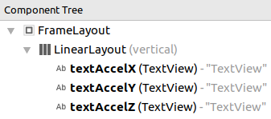

Accelerometer Fragment
======================

Let's start by creating another fragment for our Accelerometer.

This time we don't have to set up the `SectionsPagerAdapter` or remove the old `PlaceholderFragment`, just create a new Fragment and add it to the already set up `SectionsPagerAdapter`.

# Another Fragment

### Add a New Fragment

1. Find the package folder.
2. Right-click > New > Fragment > Fragment (Blank)
3. Configure Component:
    - Fragment Name: AccelFragment
    - &#9745; Create layout XML?
    - Layout Name: fragment_accel
    - &#9744; Include fragment factory methods?
    - &#9744; Include interface callbacks?
4. Click **Finish**

*Note: if you need help, look over the steps in Task 1 - Creating a New Fragment or ask for help*

### Add the Fragment to the `SectionsPagerAdapter`

1. Open `MainActivity`
2. Find `SectionsPagerAdapter`. It should be near the bottom of the file.
3. Add our new `AccelFragment` after `HomeFragment`

```java
Fragment[] fragments = { 
    new HomeFragment(),
    new AccelFragment() 
};
String[] tabNames = {
    "Home Tab",
    "Accelerometer"
};
```

4. Save.

It's a good time to Run your app again to see that we've created the new Fragment and tab properly. If it's all working well, you'll have 2 tabs: "**HOME TAB**" and "**ACCELEROMETER**". Both of them blank, except for text that says "Hello blank fragment".

# Creating Content

Our Tablet's accelerometer has 3 readings:

- X: Left &lrarr; Right;
- Y: Top &lrarr; Bottom;
- Z: Front &lrarr; Back;

Each reading tells you the device's acceleration in that direction (or reverse if negative). It's not something we think about all the time, but gravity is *ALWAYS* accelerating us towards the ground, so using the accelerometer readings we could figure out which way the device is oriented, compared to the earth.

We'll want to see the device readings, so let's add some text fields to our layout.

1) Open fragment_accel.xml  
[](images/layout_fragment_accel.png)
2) Select the **Design** tab at the bottom of the page.  
[](images/fragment_accel_design.png)  
*Take note of the Component Tree view as well as the Palette and it's items.
3) Delete the existing TextView
4) Create a new `LinearLayout (vertical)` by dragging it from the Palette down onto the `FrameLayout` in the Component Tree
5) Create 3 `TextView`s by dragging them onto the `LinearLayout`  
   The `TextView`s will be given generic IDs, so lets change them to:
   - textAccelX
   - textAccelY
   - textAccelZ

   You can change them in the properties panel on the right hand side.  
   [](images/textAccelX_properties_panel.png)
6) You should end up with something looking like this:  
   [](images/accel_layout_after.png)


Now that we have some text fields, let put some data in them.

# Changing the TextViews from our Fragment

At the moment, our textAccelX TextView just says "TextView". We can change this in the layout but we are going to want to change this from the Fragment so we can do it interactively later. So lets set this up.

1) Open `AccelFragment`
2) In the `AccelFragment class` create a field variable for each TextView. Creating a field variable here allows us to use it anywhere in this class, once we have set it.  
   ```java
   public class AccelFragment extends Fragment {
       TextView textAccelX;
       TextView textAccelY;
       TextView textAccelZ;
   ```  
   *If TextView is red, you can press Alt+Enter to automatically add  
   `import android.widget.TextView;`  
   to the file.*

3) Those field variables are empty at the moment, so we should point them at the widgets from the layout. A good time to do this is when the view is created, which is something that Fragments already track, so let's use that. 
   1. Right click in the file > Generate > Override
   2. In the Fragment list, select `onViewCreated`
   3. Press **OK**

   The following should have been created:
   
   ```java
   @Override
   public void onViewCreated(View view, @Nullable Bundle savedInstanceState) {
       super.onViewCreated(view, savedInstanceState);
   }
   ```
   *This code runs whenever the view is created!*

4) Set the values of the textAccel variables after the `super` line.

   ```java
   @Override
   public void onViewCreated(View view, @Nullable Bundle savedInstanceState) {
       super.onViewCreated(view, savedInstanceState);

       // Point the field variables to the widgets from the view
       // using the IDs we gave them in fragment_accel.xml
       textAccelX = (TextView) view.findViewById(R.id.textAccelX);
       textAccelY = (TextView) view.findViewById(R.id.textAccelY);
       textAccelZ = (TextView) view.findViewById(R.id.textAccelZ);
   }
   ```

   *The `R.id.textAccelX`, etc, is generated for us by Android Studio*

5) Now we can set the text value! It will only be updated when the view is created but we will change that later. Let's display a simple message for now.

   ```java
   public void onViewCreated(View view, @Nullable Bundle savedInstanceState) {
       super.onViewCreated(view, savedInstanceState);
       
       // Point the field variables to the widgets from the view
       // using the IDs we gave them in fragment_accel.xml
       textAccelX = (TextView) view.findViewById(R.id.textAccelX);
       textAccelY = (TextView) view.findViewById(R.id.textAccelY);
       textAccelZ = (TextView) view.findViewById(R.id.textAccelZ);
       
       // Set the text manually so we can see that it updates.
       textAccelX.setText("My Fragment class is: " + this.getClass().getName());
       textAccelY.setText("It is now: " + new Date());
       textAccelZ.setText("Welcome to Android programming!");
   }
   ```

Run your app again and see what comes up!

Okay, it doesn't change or update, so let's do that now. We don't need the `.setText` lines anymore so feel free to delete them.

# Reading From the Accelerometer

The Accelerometer is a sensor accessible through the Sensor Manager which is available to all activities. We need to get the Sensor Manager and register an event listener with it to recieve sensor updates. 

1) At the bottom of `AccelFragment`, create a `SensorEventListener` using the following code.
   ```java
   class MySensorEventListener implements SensorEventListener {
       @Override
       public void onSensorChanged(SensorEvent sensorEvent) {
           // This function is called when the sensor updates.
           // sensorEvent contains the new sensor data in an
           // values: [0: X reading, 1: Y reading, 2: Z reading]
           textAccelX.setText("X: " + sensorEvent.values[0]);
           textAccelY.setText("Y: " + sensorEvent.values[1]);
           textAccelZ.setText("Z: " + sensorEvent.values[2]);
       }
       
       // We aren't going to use this, but it needs to be here!
       @Override public void onAccuracyChanged(Sensor sensor, int i) {}
   }
   ```

2) Back in `onViewCreated`, lets register our listener.

   ```java
   @Override
   public void onViewCreated(View view, @Nullable Bundle savedInstanceState) {
       super.onViewCreated(view, savedInstanceState);
   
       // Point the field variables to the widgets from the view
       // using the IDs we gave them in fragment_accel.xml
       textAccelX = (TextView) view.findViewById(R.id.textAccelX);
       textAccelY = (TextView) view.findViewById(R.id.textAccelY);
       textAccelZ = (TextView) view.findViewById(R.id.textAccelZ);
   
       // Get the sensor manager from the Android Activity System Service
       SensorManager sensorManager = (SensorManager) getActivity().getSystemService(Context.SENSOR_SERVICE);
       
       // Get the accelerometer sensor from the sensor manager
       Sensor accelSensor = sensorManager.getDefaultSensor(Sensor.TYPE_ACCELEROMETER);
       
       // Create an "instance" of MySensorEventListener
       MySensorEventListener myListener = new MySensorEventListener();
       
       // Register our listener with the sensor manager
       sensorManager.registerListener(myListener, accelSensor, SensorManager.SENSOR_DELAY_NORMAL);
   }
   ```
Run your app and now you should be able to see the values updating on the screen!

## Next: [Task 3 - Geolocation and Maps](task3_maps.md)

---

## Extra Credit: 

Go to https://github.com/GregorWebDesign/gscc-workshop

Find and read through these files and see if you can get them working in your app:
- [AccelBarsFragment.java](https://github.com/GregorWebDesign/gscc-workshop/blob/master/app/src/main/java/au/edu/catholic/goodshepherd/myapplication/AccelBarsFragment.java)
- [fragment_accel_bars.xml](https://github.com/GregorWebDesign/gscc-workshop/blob/master/app/src/main/res/layout/fragment_accel_bars.xml)
- [Strings resource file](https://github.com/GregorWebDesign/gscc-workshop/blob/master/app/src/main/res/values/strings.xml)