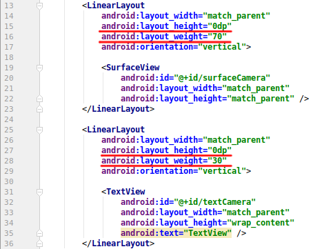

Using the Camera to Read Barcodes
=================================

As usual, we'll start with a new Fragment

### Add a New Fragment

1. Find the package folder.
2. Right-click > New > Fragment > Fragment (Blank)
3. Configure Component:
    - Fragment Name: CameraFragment
    - &#9745; Create layout XML?
    - Layout Name: fragment_accel
    - &#9744; Include fragment factory methods?
    - &#9744; Include interface callbacks?
4. Click **Finish**

*Note: if you need help, look over the steps in Task 1 - Creating a New Fragment or ask for help*

### Add the Fragment to the `SectionsPagerAdapter`

1. Open `MainActivity`
2. Find `SectionsPagerAdapter`. It should be near the bottom of the file.
3. Add our new `AccelFragment` after `HomeFragment`

```java
Fragment[] fragments = { 
    new HomeFragment(),
    new AccelFragment(),
    new MapFragment(),  // remember the commas!
    new CameraFragment()
};
String[] tabNames = {
    "Home Tab",
    "Accelerometer",
    "Map", // remember the commas!
    "Camera"
};
```

Run your app again. You'll see 4 tabs now: "**HOME TAB**", "**ACCELEROMETER**", "**MAP**", and "**CAMERA**".

# Adding a Map container to the Layout `fragment_camera.xml`

We aren't going to put the map directly into the layout. We are going to create a container for the map to go in, and a small area to put some text and buttons.

1) Open fragment_map.xml  
2) Select the **Design** tab at the bottom of the page.  
3) Delete the existing TextView
4) We want our layout to look like this:
    - FrameLayout
        - LinearLayout
            - LinearLayout
                - SurfaceView - Change the ID to "surfaceCamera"  
                *If you're having trouble finding it, look under Advanved*
            - LinearLayout
                - Switch - Change ID to "switchCamera"
                - TextView - Change the ID to "textCamera"

5) We want the same 70-30 ratio between the Camera and the space like we had with the map, so switch over to the `Text` tab instead of the `Design` tab and add the layout weights (and set the heights to 0dp)  
   [](images/layout_camera_weight.png)

# Camera Permission

We can't just use the camera without asking... add the following lines to yout Manifest below `ACCESS_FINE_PERMISSION`

```xml
<uses-permission android:name="android.permission.CAMERA" />
<uses-feature android:name="android.hardware.camera2.full" />
```

# Camera Support

The Barcode reading doesn't come with Android but we can use the Google one simply enough!

Open `build.gradle (Module:app)` and update the dependencies section so it looks like this:

```groovy
dependencies {
    compile fileTree(dir: 'libs', include: ['*.jar'])
    androidTestCompile('com.android.support.test.espresso:espresso-core:2.2.2', {
        exclude group: 'com.android.support', module: 'support-annotations'
    })
    compile 'com.android.support:appcompat-v7:25.3.1'
    compile 'com.android.support:design:25.3.1'
    compile 'com.android.support:support-v4:25.3.1'

    compile 'com.google.android.gms:play-services-maps:11.0.4'
    compile 'com.google.android.gms:play-services-location:11.0.4'
    compile 'com.google.maps.android:android-maps-utils:0.5'

    compile 'com.google.android.gms:play-services-vision:11.0.4'

    testCompile 'junit:junit:4.12'
}
```
*We're just adding the `com.google`...`vision` one this time.*

# Camera Turn On

The way the camera works in this example is quite tied up with the barcode/vision code, which means it would be much harder to do this progressively, so let's just get it done!

### Field Variables

```java
SurfaceView surfaceCamera;
Switch switchCamera;
TextView textCamera;

// We need to keep track of these too
CameraSource cameraSource;
BarcodeDetector detector;
```
*Near the top, underneath `class CameraFragment`

### Detector Processor

This is like the `LocationListener`. Whenever there is a detector event, this will be called to process it.

```java
class MyDetector implements Detector.Processor<Barcode> {
    @Override public void release() {}

    @Override
    public void receiveDetections(Detector.Detections<Barcode> detections) {
        // We read the detections into an array of barcodes
        final SparseArray<Barcode> barcodes = detections.getDetectedItems();

        // Make sure some barcodes exist
        if (barcodes.size() != 0) {
            // use post because we're actually in a different thread right now!
            textCamera.post(new Runnable() {    // Use the post method of the TextView
                public void run() {
                    // get the first barcode from the array and show it on screen.
                    textCamera.setText(barcodes.valueAt(0).displayValue);
                }
            });
        }
    }
}
```

### onViewCreated

Normally we create this using the Override Functions Menu, but it can be written in too.

```java
@Override
public void onViewCreated(View view, @Nullable Bundle savedInstanceState) {
    super.onViewCreated(view, savedInstanceState);

    // find the views for our field variables
    surfaceCamera = (SurfaceView) view.findViewById(R.id.surfaceCamera);
    switchCamera = (Switch) view.findViewById(R.id.switchCamera);
    textCamera = (TextView) view.findViewById(R.id.textCamera);

    // This is the action that happens with the switch is toggled
    switchCamera.setOnCheckedChangeListener(new CompoundButton.OnCheckedChangeListener() {
        @Override
        public void onCheckedChanged(CompoundButton b, boolean isToggledOn) {
            if (isToggledOn) {
                // Check we have the correct permission and give a warning if not
                if (ActivityCompat.checkSelfPermission(getContext(), Manifest.permission.CAMERA) != PackageManager.PERMISSION_GRANTED) {
                    textCamera.setText("You don't have permission to use the camera!");
                    // then don't do anything else
                    return;
                }

                textCamera.setText("Switch flipped 'ON'");

                // Create a barcode detector using the Builder.
                detector = new BarcodeDetector.Builder(getActivity().getApplicationContext())
                        // Let's detect ALL FORMATs of barcodes!
                        .setBarcodeFormats(Barcode.ALL_FORMATS)
                        .build();

                detector.setProcessor(new MyDetectorProcessor());

                // Create a camera source for our detector and our surfaceView
                // This needs the `final` keyword because we are using it inside a callback below
                cameraSource = new CameraSource.Builder(getContext(), detector)
                        .setAutoFocusEnabled(true)
                        .setFacing(CameraSource.CAMERA_FACING_BACK)
                        .setRequestedFps(15.0f)
                        .setRequestedPreviewSize(640, 480)
                        .build();

                try {
                    textCamera.setText("Starting Camera!");
                    // Start the camera
                    cameraSource.start(surfaceCamera.getHolder());
                    textCamera.setText("Camera Running! Find a Barcode.");
                }
                // If there was an error starting the camera...
                catch (IOException e) {
                    // Display a message
                    textCamera.setText("There was a Camera Start Error! "  + e.getMessage());
                }
            } else {
                // If we toggle the switch off, stop the camera
                cameraSource.stop();
                textCamera.setText("Camera Paused");
            }
        }
    });
}
```

